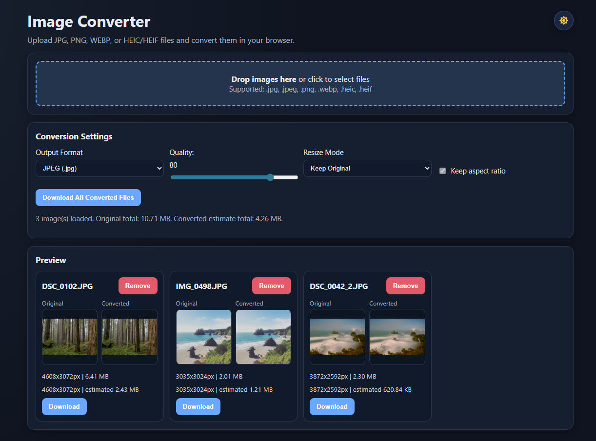

# Image Converter

Browser-based image converter for `JPG/JPEG`, `PNG`, `WEBP`, and `HEIC/HEIF` input files.

You can upload one or many images, choose output format, resize, adjust quality, preview the converted result, see estimated output size, and download converted files.

## Features

- Multi-file upload via file picker or drag-and-drop
- Input support: `jpg`, `jpeg`, `png`, `webp`, `heic`, `heif`
- Output formats: `jpeg (jpg)`, `png`, `webp`
- Resize modes: keep original size, scale by percent, or set exact width/height with optional aspect-ratio lock
- Quality control for lossy output formats
- Side-by-side original and converted thumbnails
- Click-to-open lightbox preview with scale indicator (`100% actual size` or fit-to-browser `%`)
- Estimated output file size per image and total
- Per-image download and “Download All Converted Files”
- Fully client-side conversion (no backend required)

## Screenshot



## Tech Stack

- Plain HTML/CSS/JavaScript
- Canvas API for conversion and resizing
- `heic2any` for HEIC/HEIF decoding in browser
- Nginx + Docker for self-hosting

## Project Structure

- `index.html` - App UI and layout
- `styles.css` - Styling
- `app.js` - Upload, conversion, preview, lightbox, downloads
- `Dockerfile` - Container image build
- `nginx.conf` - Nginx static hosting config
- `docker-compose.yml` - Quick local/self-host deployment

## Run Locally

This is a static app. You can open `index.html` directly, but using a local server is recommended.

Example (Python):

```bash
python -m http.server 8080
```

Open:

- `http://localhost:8080`

## Docker

Build and run:

```bash
docker build -t image-converter:latest .
docker run -d --name image-converter -p 8080:80 --restart unless-stopped image-converter:latest
```

Open:

- `http://localhost:8080`

Using Docker Compose:

```bash
docker compose up -d --build
```

## Self-Hosting

1. Install Docker and Docker Compose on your server.
2. Clone/copy this project.
3. Run `docker compose up -d --build`.
4. Put a reverse proxy (Nginx/Caddy/Traefik) in front for HTTPS and domain routing.

## HEIC/HEIF Note

- HEIC/HEIF decoding depends on `heic2any` loaded from jsDelivr in `index.html`.
- If clients cannot access that CDN, HEIC conversion will not work.
- To make deployment fully offline/self-contained, vendor `heic2any` locally and reference a local script path.

## Privacy

- Conversions happen in the browser using client-side JavaScript.
- Images are not uploaded to a server by this app.

## GitHub

- Repository: `https://github.com/yoheiocean/image-converter`
